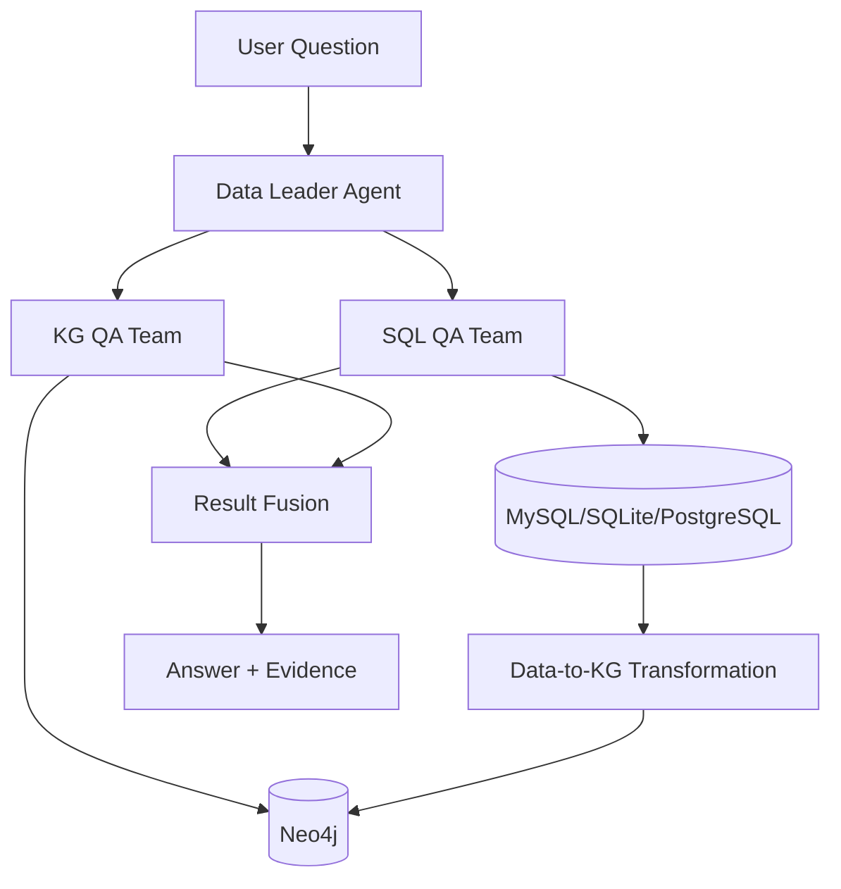

# WisdominDATA (智数)

[](README.md)
[](README.zh-CN.md)

<p align="center">
  
</p>

<p align="center">
  <strong>DataFactory</strong> · Collaborative Multi-Agent Framework for Advanced Table Question Answering
</p>

<p align="center">
  
  
  
  
  
</p>

Wisdom in Data is an open multi-agent TableQA platform that unifies relational reasoning (SQL) and graph reasoning (Cypher) in one production-ready workflow.

Paper: **DataFactory: Collaborative Multi-Agent Framework for Advanced Table Question Answering** (Information Processing & Management).

中文请看: `README.zh-CN.md`

## Highlights

- Multi-agent orchestration with Data Leader + SQL team + KG team
- Database-grounded answers with verifiable SQL/Cypher evidence
- Automated relational-to-graph transformation (`T : D x S x R -> G`)
- Hybrid analytics on MySQL + Neo4j with one unified UI
- Ollama embedding integration for retrieval-enhanced QA

## Architecture



## Core Runtime Components

- `app`: Flask service + UI
- `mysql`: primary relational store for SQL QA (docker default)
- `neo4j`: graph store for KG construction and graph QA
- `ollama` (external service): embedding and naming models

## Deployment Matrix

| Component | Role | Default in Compose | Key Variables |
|---|---|---|---|
| App | Web + API service | `app` | `APP_PORT`, `FLASK_ENV` |
| MySQL | Structured data / SQL QA | `mysql` | `DATABASE_*` |
| Neo4j | Knowledge graph storage/query | `neo4j` | `NEO4J_*` |
| Ollama | Embedding + naming model service | external | `OLLAMA_URL`, `OLLAMA_EMBEDDING_MODEL`, `OLLAMA_NAMING_MODEL` |

## Tech Stack

- Backend: Python, Flask
- Frontend: HTML/CSS/JavaScript (Webpack, D3.js, Bootstrap)
- Relational DB: MySQL / SQLite / PostgreSQL
- Graph DB: Neo4j
- LLM stack: Vanna, LangChain, LangGraph, Ollama, OpenAI-compatible APIs

## Quick Start

### Local (uv)

```bash
uv sync
uv run python app.py
```

### Docker (recommended for full stack)

```bash
cp docker.env.example .env
docker compose up -d --build
```

Open `http://127.0.0.1:5000`.

## Demo Videos

<p align="center"><strong>See Wisdom in Data in action</strong><br/>A card-based walkthrough from SQL QA to KG QA and final multi-agent decision orchestration.</p>

<table>
  <tr>
    <td>
      <h3>Database QA</h3>
      <p><em>Natural-language question to SQL generation, execution, and analytical answer synthesis.</em></p>
      <p><strong>Highlights:</strong> schema-aware SQL generation · grounded answers · structured result interpretation</p>
      <p align="center">
        <a href="https://www.youtube.com/watch?v=4Srmu_E0bBw" target="_blank" rel="noopener noreferrer">
          
        </a>
      </p>
    </td>
  </tr>
</table>

<table>
  <tr>
    <td>
      <h3>Knowledge Graph QA</h3>
      <p><em>Cypher generation over Neo4j with relation-aware retrieval and interpretable graph answers.</em></p>
      <p><strong>Highlights:</strong> graph-schema-aware retrieval · subgraph reasoning · explainable relation paths</p>
      <p align="center">
        <a href="https://www.youtube.com/watch?v=XCWJ5V2IMh4" target="_blank" rel="noopener noreferrer">
          
        </a>
      </p>
    </td>
  </tr>
</table>

<table>
  <tr>
    <td>
      <h3>Multi-Agent Decision and Orchestration</h3>
      <p><em>Data Leader coordinates SQL and KG teams to solve complex decision tasks end-to-end.</em></p>
      <p><strong>Highlights:</strong> ReAct loop · cross-team dispatch · iterative evidence synthesis</p>
      <p align="center">
        <a href="https://www.youtube.com/watch?v=NdJ5UBcNZnc" target="_blank" rel="noopener noreferrer">
          
        </a>
      </p>
    </td>
  </tr>
</table>

## End-to-End Startup (MySQL + Neo4j + Ollama)

1. Start local Ollama service (host or separate container).
2. Pull required models:

```bash
ollama pull bge-m3:latest
ollama pull qwen3:1.7b
```

3. Configure `.env` from `docker.env.example`.
4. Start stack:

```bash
docker compose up -d --build
```

## MySQL and Neo4j in This Project

- **MySQL**
  - Default docker service: `mysql:8.0.39`
  - Key envs: `DATABASE_HOST`, `DATABASE_PORT`, `DATABASE_USER`, `DATABASE_PASSWORD`, `DATABASE_NAME`
  - Default compose DB name: `evaluation_test_db`
- **Neo4j**
  - Default docker service is built from `docker/neo4j/Dockerfile`
  - Key envs: `NEO4J_URI`, `NEO4J_USER`, `NEO4J_PASSWORD`
  - APOC/GDS procedures are enabled via compose envs

Quick health checks after startup:

```bash
docker compose ps
docker exec wisdomindata-mysql mysqladmin ping -uroot -p123456
docker exec wisdomindata-neo4j cypher-shell -u neo4j -p 12345678 "RETURN 1"
```

## Ollama Embedding Model Usage

Ollama is used in two places:

- **Embedding model** for vector retrieval (Chroma store)
- **Naming model** for automatic conversation title generation

### Required env vars

- `OLLAMA_URL` (example: `http://host.docker.internal:11434`)
- `OLLAMA_EMBEDDING_MODEL` (default: `bge-m3:latest`)
- `OLLAMA_NAMING_MODEL` (default: `qwen3:1.7b`)

### Related config mapping

In `config.docker.json`:

- `store_database.embedding_function` <= `OLLAMA_EMBEDDING_MODEL`
- `store_database.embedding_ollama_url` <= `OLLAMA_URL`
- `naming_model.ollama_model` <= `OLLAMA_NAMING_MODEL`

### Prepare Ollama models

```bash
ollama pull bge-m3:latest
ollama pull qwen3:1.7b
```

### Why `bge-m3:latest`

- Strong multilingual embedding quality (English/Chinese mixed workloads)
- Stable retrieval behavior for schema text + question history
- Good default latency/quality balance for self-hosted scenarios

If you use a custom embedding model, set it in `.env`:

```bash
OLLAMA_EMBEDDING_MODEL=<your-embedding-model>
```

## Important Environment Variables

- Database: `DATABASE_*`
- Graph: `NEO4J_*`
- Ollama: `OLLAMA_URL`, `OLLAMA_EMBEDDING_MODEL`, `OLLAMA_NAMING_MODEL`
- OpenRouter/OpenAI compatible: `OPENROUTER_*`, `OPENAI_*`

Template file: `docker.env.example`

## Repository Structure

```text
.
├── app.py
├── backend/
├── docker/
├── templates/
├── static/
├── test/
├── docker-compose.yml
├── docker.env.example
├── pyproject.toml
└── requirements.txt
```

## Citation

```bibtex
@article{datafactory_ipm_2026,
  title   = {DataFactory: Collaborative Multi-Agent Framework for Advanced Table Question Answering},
  author  = {TODO: Authors},
  journal = {Information Processing & Management},
  year    = {2026},
  volume  = {TODO},
  number  = {TODO},
  pages   = {TODO},
  doi     = {TODO}
}
```

## Acknowledgements

- Vanna: https://github.com/vanna-ai/vanna
- LangChain: https://github.com/langchain-ai/langchain
- LangGraph: https://github.com/langchain-ai/langgraph
- Neo4j: https://github.com/neo4j/neo4j

## License

This project is licensed under **PolyForm Noncommercial 1.0.0**.

- Commercial use is not permitted under this license.
- See `LICENSE` for full terms.
