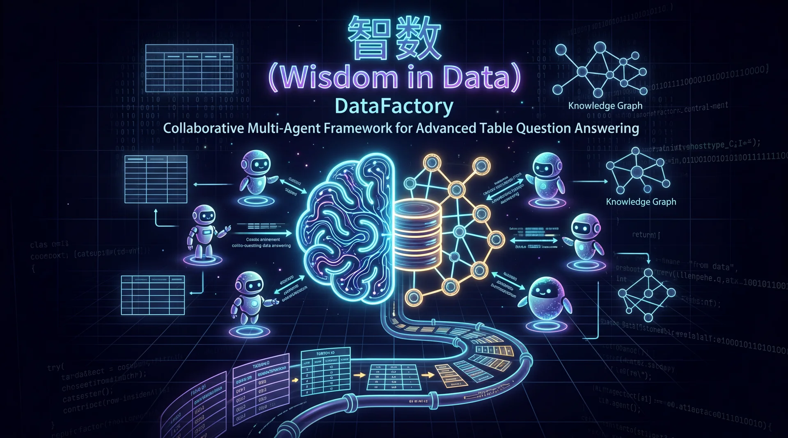
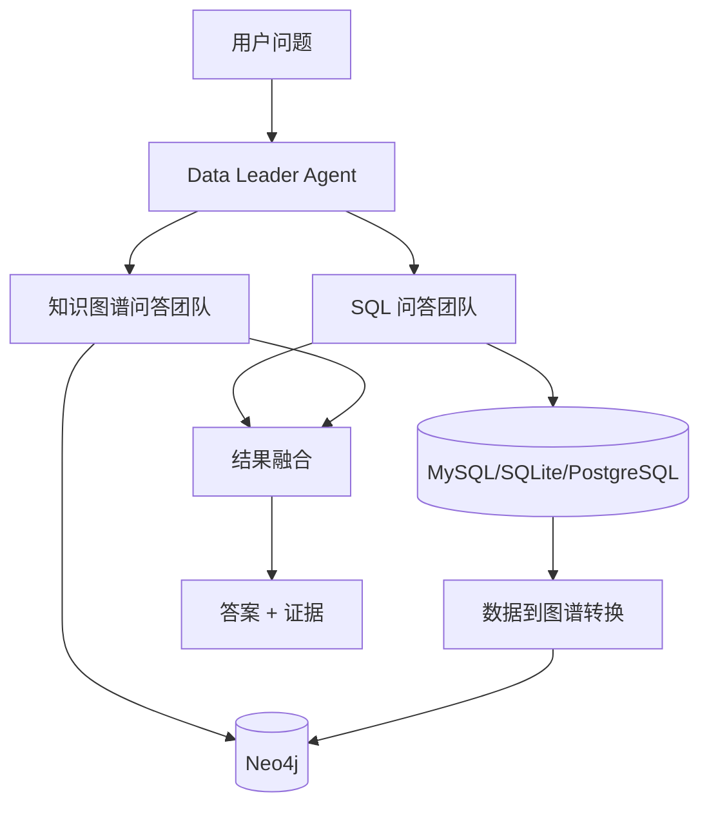

# 智数 (WisdominDATA)

[](README.md)
[](README.zh-CN.md)

<p align="center">
  
</p>

<p align="center">
  <strong>DataFactory</strong> · 面向高级表格问答的协作式多智能体框架
</p>

<p align="center">
  
  
  
  
  
</p>

Wisdom in Data（智数）是一个开源多智能体 TableQA 平台，在同一工作流中统一支持关系数据库推理（SQL）与知识图谱推理（Cypher）。

论文：**DataFactory: Collaborative Multi-Agent Framework for Advanced Table Question Answering**（Information Processing & Management）。

English README: `README.md`

## 平台亮点

- Data Leader + SQL Team + KG Team 协同编排
- 基于 SQL/Cypher 可验证结果降低幻觉
- 支持关系数据到图谱自动转换（`T : D x S x R -> G`）
- MySQL 与 Neo4j 联合分析的一体化界面
- 集成 Ollama embedding 提升检索增强问答能力

## 架构概览



## 运行时核心组件

- `app`：Flask 服务与前端页面
- `mysql`：SQL 问答主数据源（docker 默认）
- `neo4j`：知识图谱存储与图问答
- `ollama`（外部服务）：向量嵌入模型与会话命名模型

## 部署组件总览

| 组件 | 作用 | Compose 默认服务 | 关键变量 |
|---|---|---|---|
| App | Web 页面 + API 服务 | `app` | `APP_PORT`, `FLASK_ENV` |
| MySQL | 结构化数据与 SQL 问答 | `mysql` | `DATABASE_*` |
| Neo4j | 知识图谱存储与查询 | `neo4j` | `NEO4J_*` |
| Ollama | Embedding + 命名模型服务 | 外部服务 | `OLLAMA_URL`, `OLLAMA_EMBEDDING_MODEL`, `OLLAMA_NAMING_MODEL` |

## 技术栈

- 后端：Python、Flask
- 前端：HTML/CSS/JavaScript（Webpack、D3.js、Bootstrap）
- 关系库：MySQL / SQLite / PostgreSQL
- 图数据库：Neo4j
- LLM 生态：Vanna、LangChain、LangGraph、Ollama、OpenAI 兼容接口

## 快速启动

### 本地（uv）

```bash
uv sync
uv run python app.py
```

### Docker（推荐完整栈）

```bash
cp docker.env.example .env
docker compose up -d --build
```

默认访问：`http://127.0.0.1:5000`。

## 平台演示视频

<p align="center"><strong>平台核心能力演示</strong><br/>采用卡片式展示，从 SQL 问答到图谱问答，再到多智能体协同决策。</p>

<table>
  <tr>
    <td>
      <h3>Database QA</h3>
      <p><em>自然语言到 SQL 自动生成、执行与结果分析的完整闭环。</em></p>
      <p><strong>亮点：</strong>Schema 感知 SQL 生成 · 基于数据结果回答 · 结构化分析输出</p>
      <p align="center">
        <a href="https://www.youtube.com/watch?v=4Srmu_E0bBw" target="_blank" rel="noopener noreferrer">
          
        </a>
      </p>
    </td>
  </tr>
</table>

<table>
  <tr>
    <td>
      <h3>KG QA</h3>
      <p><em>基于 Neo4j 的 Cypher 推理检索与关系可解释问答。</em></p>
      <p><strong>亮点：</strong>图谱 schema 感知检索 · 子图关系推理 · 关系路径可解释</p>
      <p align="center">
        <a href="https://www.youtube.com/watch?v=XCWJ5V2IMh4" target="_blank" rel="noopener noreferrer">
          
        </a>
      </p>
    </td>
  </tr>
</table>

<table>
  <tr>
    <td>
      <h3>智能体协同决策</h3>
      <p><em>Data Leader 协调 SQL/KG 团队，完成复杂决策型任务的端到端推理。</em></p>
      <p><strong>亮点：</strong>ReAct 循环 · 跨团队动态分发 · 多源证据迭代融合</p>
      <p align="center">
        <a href="https://www.youtube.com/watch?v=NdJ5UBcNZnc" target="_blank" rel="noopener noreferrer">
          
        </a>
      </p>
    </td>
  </tr>
</table>

## 一键联调流程（MySQL + Neo4j + Ollama）

1. 先启动本地 Ollama 服务（宿主机或独立容器）。
2. 拉取所需模型：

```bash
ollama pull bge-m3:latest
ollama pull qwen3:1.7b
```

3. 基于 `docker.env.example` 生成 `.env`。
4. 启动整套服务：

```bash
docker compose up -d --build
```

## 项目中的 MySQL 与 Neo4j

- **MySQL**
  - 默认镜像：`mysql:8.0.39`
  - 关键环境变量：`DATABASE_HOST`、`DATABASE_PORT`、`DATABASE_USER`、`DATABASE_PASSWORD`、`DATABASE_NAME`
  - compose 默认库名：`evaluation_test_db`
- **Neo4j**
  - 默认由 `docker/neo4j/Dockerfile` 构建
  - 关键环境变量：`NEO4J_URI`、`NEO4J_USER`、`NEO4J_PASSWORD`
  - compose 中默认开启 APOC/GDS 相关过程

启动后可快速健康检查：

```bash
docker compose ps
docker exec wisdomindata-mysql mysqladmin ping -uroot -p123456
docker exec wisdomindata-neo4j cypher-shell -u neo4j -p 12345678 "RETURN 1"
```

## Ollama Embedding 模型使用说明

本项目对 Ollama 的使用分为两类：

- **嵌入模型（Embedding）**：用于向量检索（Chroma）
- **命名模型（Naming）**：用于会话标题自动生成

### 关键环境变量

- `OLLAMA_URL`（例如：`http://host.docker.internal:11434`）
- `OLLAMA_EMBEDDING_MODEL`（默认：`bge-m3:latest`）
- `OLLAMA_NAMING_MODEL`（默认：`qwen3:1.7b`）

### 配置映射关系

在 `config.docker.json` 中：

- `store_database.embedding_function` <= `OLLAMA_EMBEDDING_MODEL`
- `store_database.embedding_ollama_url` <= `OLLAMA_URL`
- `naming_model.ollama_model` <= `OLLAMA_NAMING_MODEL`

### 模型准备

```bash
ollama pull bge-m3:latest
ollama pull qwen3:1.7b
```

### 为什么默认用 `bge-m3:latest`

- 中英文混合场景下语义向量表现稳定
- 对 schema 文本和历史问答检索效果较好
- 在自部署环境中具备较好的速度/效果平衡

如需替换嵌入模型，直接在 `.env` 中设置：

```bash
OLLAMA_EMBEDDING_MODEL=<your-embedding-model>
```

## 重要环境变量

- 数据库：`DATABASE_*`
- 图数据库：`NEO4J_*`
- Ollama：`OLLAMA_URL`、`OLLAMA_EMBEDDING_MODEL`、`OLLAMA_NAMING_MODEL`
- OpenRouter/OpenAI 兼容：`OPENROUTER_*`、`OPENAI_*`

模板文件：`docker.env.example`

## 仓库结构

```text
.
├── app.py
├── backend/
├── docker/
├── templates/
├── static/
├── test/
├── docker-compose.yml
├── docker.env.example
├── pyproject.toml
└── requirements.txt
```

## 引用

```bibtex
@article{datafactory_ipm_2026,
  title   = {DataFactory: Collaborative Multi-Agent Framework for Advanced Table Question Answering},
  author  = {TODO: Authors},
  journal = {Information Processing & Management},
  year    = {2026},
  volume  = {TODO},
  number  = {TODO},
  pages   = {TODO},
  doi     = {TODO}
}
```

## 致谢

- Vanna: https://github.com/vanna-ai/vanna
- LangChain: https://github.com/langchain-ai/langchain
- LangGraph: https://github.com/langchain-ai/langgraph
- Neo4j: https://github.com/neo4j/neo4j

## 许可证

本项目采用 **PolyForm Noncommercial 1.0.0** 许可证。

- 该许可证不允许商业使用。
- 完整条款见 `LICENSE`。
